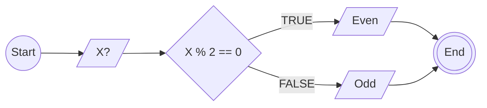

## Algoritma Menentukan bilangan ganjil dan genap

1. Mulai
2. Masukan Bilangan yang ingin di periksa
3. Periksa apakah bilangan % 2 == 0
4. Jika ya, maka tampilkan: "Bilangan Genap"
5. Jika tidak, maka tampilkan: "Bilangan Ganjil"
6. Selesai

## Flowchart

