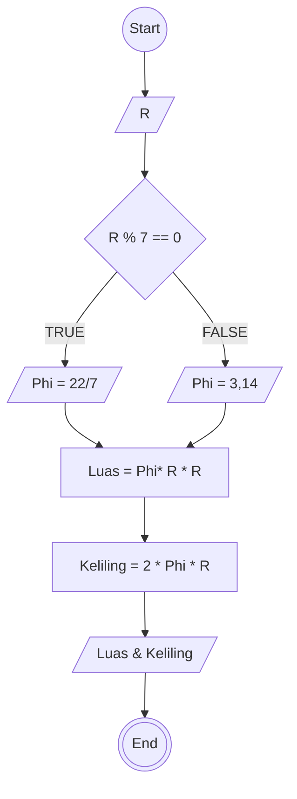

# Algoritma Menghitung Luas dan keliling lingkaran

1. Mulai

2. Masukkan jari-jari lingkaran (disebut: R)
3. jika r habis dibagi 7 maka gunakan phi = 22/7,jika tidak sebagai 3.14

4. Hitung Luas dengan rumus: Luas = Phi* R* R

5. Hitung Keliling dengan rumus: Keliling = 2* Phi* R
6. Tampilkan hasil Luas dan Keliling

7. Selesai

## PseudoCode

```
DECLARE R : REAL
DECLARE Phi : REAL
DECLARE Luas : REAL
DECLARE Keliling : REAL

INPUT R
IF R % 7 === 0 THEN
  Phi <-- 22/7
ELSE
  Phi <- 3.14
LUAS <- Phi x R x R
KELILING <- 2 x Phi x R

OUTPUT LUAS,KELILING

```

## FLOWCHART


