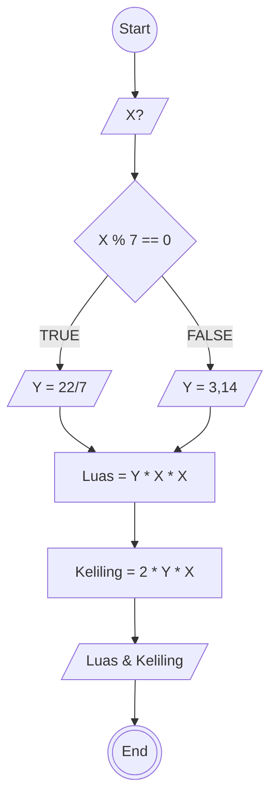

# Algoritma Menghitung Luas dan keliling lingkaran

1. Mulai

2. Masukkan jari-jari lingkaran (disebut: r)
3. jika r habis dibagi 7 maka gunakan phi = 22/7,jika tidak sebagai 3.14

4. Hitung Luas dengan rumus: Luas = phi* r* r

5. Hitung Keliling dengan rumus: Keliling = 2* phi* r
6. Tampilkan hasil Luas dan Keliling

7. Selesai

## PseudoCode

```
DECLARE R : REAL
DECLARE PHI : REAL
DECLARE LUAS : REAL
DECLARE KELILING : REAL

INPUT R
IF R % 7 === 0 THEN
  PHI <-- 22/7
ELSE
  PHI <- 3.14
LUAS <- PHI x R x R
KELILING <- 2 x PHI x R

OUTPUT "HASIL PENJUMLAHAN ADALAH",LUAS,KELILING

```

## FLOWCHART


