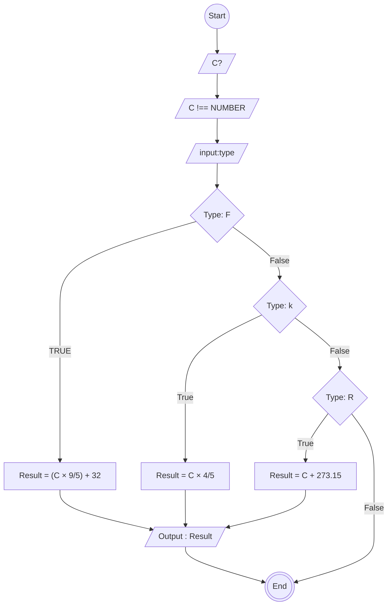

# Algoritma Menentukan suhu Celsius (C), Farenheit (F), Reamur (R), dan Kelvin(K)

1. Mulai

2. Masukkan suhu dalam satuan Celsius (C)
3. Pilih Type :
4. Jika Type "F" Hitung Fahrenheit (F) dengan rumus:
   → F = (C × 9/5) + 32

5. Jika Type "R" Hitung Reamur (R) dengan rumus:
   → R = C × 4/5

6. Jika Type "K" Hitung Kelvin (K) dengan rumus:
   → K = C + 273.15

7. Tampilkan hasil suhu dalam satuan Fahrenheit, Reamur, dan Kelvin

8. Selesai

# PSEUCODE

```
DECLARE CALCIUS :REAL
DECLARE KELVIN REAL
DECLARE FARENHEIT : REAL
DECLARE REAMUR : REAL
DECLARE TYPE : CHAR
DECLARE RESULT : REAL
INPUT CALCIUS

IF TYPE == "K"
   RESULT <- CALCIUS + 23
ENDIF
IF TYPE == "F"
   RESULT <- (9/5 x CALCIUS) + 32
ENDIF
IF TYPE == "R"
   RESULT <- 4/5 x CALCIUS
ENDIF

OUTPUT "HASIL KONVERSI ADALAH",RESULT
```

# FLOWCHART


