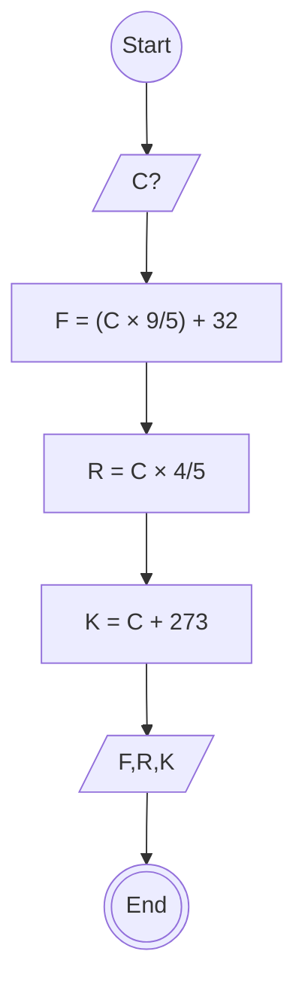

# Algoritma Menentukan suhu Celsius (C), Farenheit (F), Reamur (R), dan Kelvin(K)

1. Mulai

2. Masukkan suhu dalam satuan Celsius (C)

3. Hitung Fahrenheit (F) dengan rumus:
   → F = (C × 9/5) + 32

4. Hitung Reamur (R) dengan rumus:
   → R = C × 4/5

5. Hitung Kelvin (K) dengan rumus:
   → K = C + 273

6. Tampilkan hasil suhu dalam satuan Fahrenheit, Reamur, dan Kelvin

7. Selesai

# FLOWCHART

